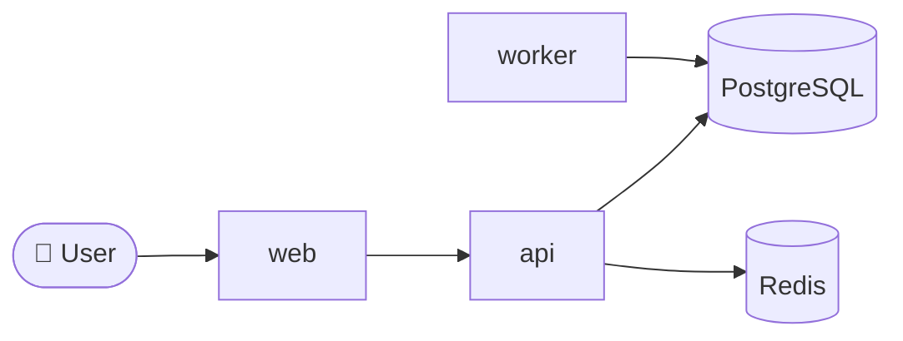

# Architecture — extracted from code

**Date:** {date}
**Based on scan:** `docs/analysis/codebase-scan.md`

## Observed containers

| Container | Evidence | Technology |
|---|---|---|
| Web app | `src/web/` + `package.json#start` | Next.js |
| API | `src/api/` + Dockerfile + k8s/api/ | Node.js / Express |
| Worker | `workers/` + compose `worker` service | Python / Celery |
| Database | `docker-compose.yml` or Terraform RDS resource | PostgreSQL |
| Cache | `docker-compose.yml` or redis manifest | Redis |

## Observed integrations

- Identity: OIDC to <provider> — evidence: `src/auth/*` env var
- Payments: Stripe — evidence: `src/billing/*` + Stripe SDK
- Object store: S3 — evidence: `src/storage/*` + IAM role

## Data flow

## Implicit decisions (candidate ADRs)

- **Language:** chose TypeScript for API — no ADR on file.
- **Auth:** chose OIDC — no ADR on file.
- **Cache:** chose Redis — no ADR on file.

> Each candidate should be promoted to a `kiss-adr` entry with
> status `Accepted` retroactively, noting "extracted from
> implementation on YYYY-MM-DD".

## Gaps

- No observable rate-limiting implementation.
- No tracing instrumentation seen.
- Mixed logging formats (JSON in `api`, plain text in `worker`).

Logged as `TDEBT-NN`.
