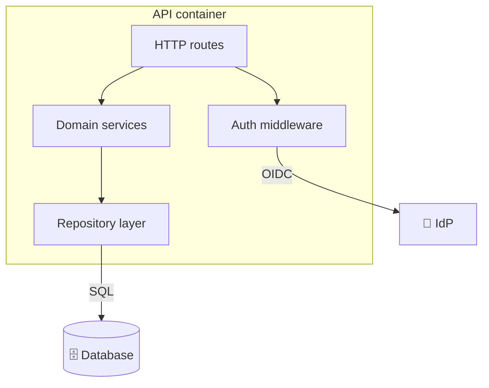

# C4 — Level 3: Components (per container)

**Date:** {date}
**Subject system:** {system_name}

## What this shows

Major internal components (classes, modules, packages) inside a
given container, and their collaboration. One section per container
worth drilling into; not every container needs a Level-3 diagram.

## Example: API container

## Components

| Name | Responsibility | Tech / Pattern |
|---|---|---|
| HTTP routes | request routing + validation | Express / FastAPI / … |
| Auth middleware | OIDC token verification | |
| Domain services | business rules | hexagonal / onion |
| Repository layer | persistence abstraction | Repository pattern |

## Notes

- If a component is getting a section of its own, it's probably
  ready to be split into a separate container.
- Code-level structure (classes, functions) belongs in
  `docs/design/<feature>/design.md`, not here.
