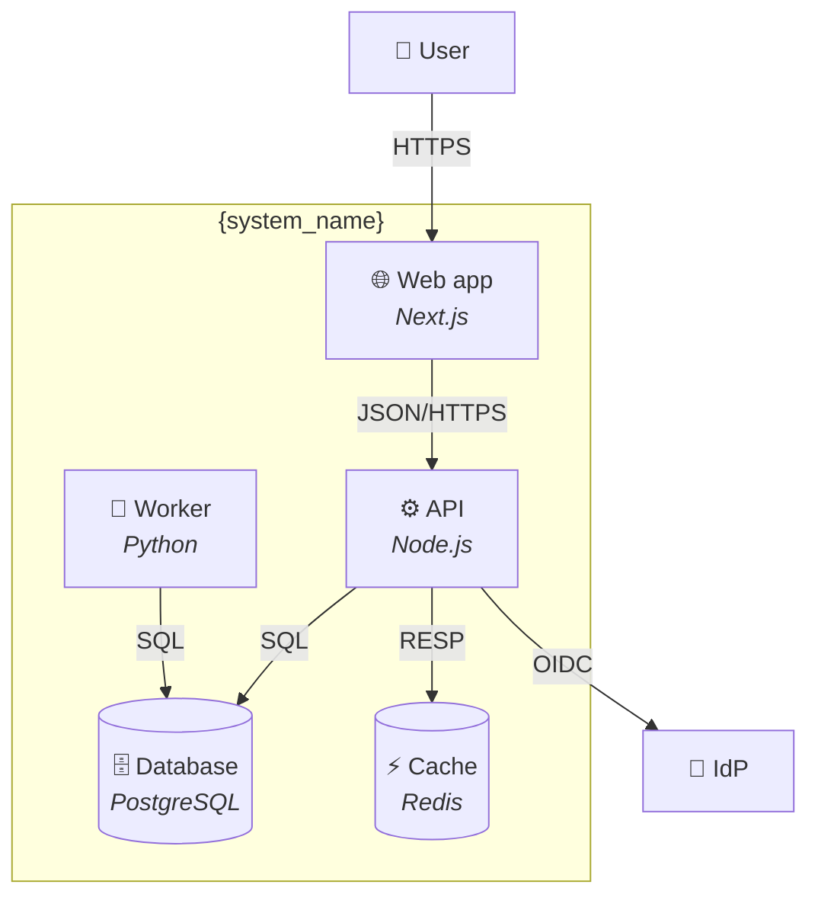

# C4 — Level 2: Containers

**Date:** {date}
**Subject system:** {system_name}

## What this shows

Deployable / runnable units inside **{system_name}** and how they
communicate. A "container" is anything independently deployable —
a web app, a service, a database, a worker, a CDN bucket.

## Diagram

## Containers

| Name | Technology | Responsibility | Owned by |
|---|---|---|---|
| Web app | <framework> | user-facing UI | |
| API | <stack> | business logic | |
| Worker | <stack> | async jobs | |
| Database | <engine> | persistent state | |
| Cache | <engine> | hot lookups | |

## Communication matrix

| From | To | Protocol | Notes |
|---|---|---|---|
| Web | API | HTTPS / JSON | |
| API | DB | SQL | |
| API | Cache | RESP | |
| Worker | DB | SQL | async writes |
