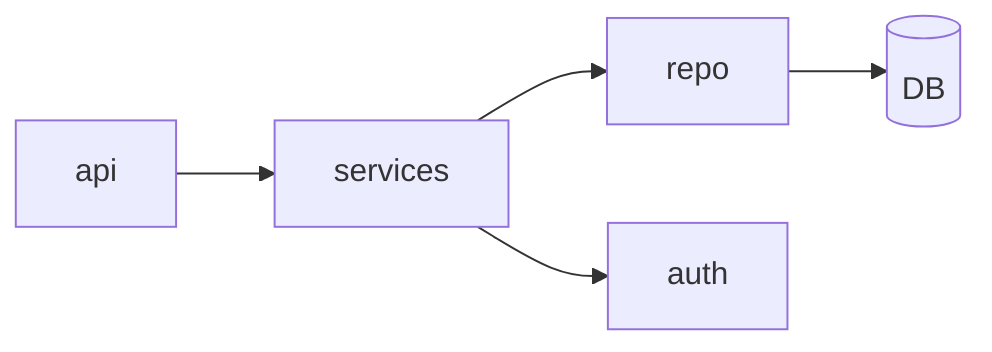

# Dependencies map

**Date:** {date}
**Max modules shown:** {max_modules}

## Internal module graph

## Top fan-in (most-depended-on)

| Module | Fan-in | Notes |
|---|---:|---|
| `src/repo` | 14 | persistence façade — candidate for split? |

## Top fan-out (most-depending)

| Module | Fan-out | Notes |
|---|---:|---|
| `src/api/routes` | 9 | aggregates services — expected |

## Circular imports

- (none detected) / <list here>

## External dependencies

| Dep | Version | Licence | Used in |
|---|---|---|---|
| express | 4.19.x | MIT | `src/server.ts` |

*(Full CVE / licence audit lives in `kiss-dependency-audit` output.)*
