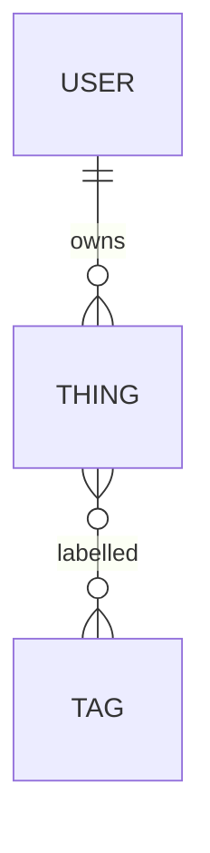

# Data Model: {feature}

**Style:** {data_style}

## Entities (relational)

### thing

| Column | Type | Constraints |
|---|---|---|
| id | UUID | PK |
| name | TEXT | NOT NULL; length 1–120 |
| created_at | TIMESTAMPTZ | NOT NULL; default now() |
| owner_id | UUID | NOT NULL; FK → user.id |

Indexes:

- `idx_thing_owner_id (owner_id)` — lookups by owner
- `idx_thing_name_lower (lower(name))` — case-insensitive search

## Relationships

## Invariants

- `name` is unique per `owner_id` (partial unique index).
- Deleting a `user` cascades to their `thing`s OR soft-deletes —
  see the ADR on data-retention.

## Migrations

- Up: create tables, indexes, seed defaults.
- Down: reverse in strict order (drop indexes → drop tables).
- **Never** alter a migration after it's merged to main; write a new
  migration instead.
