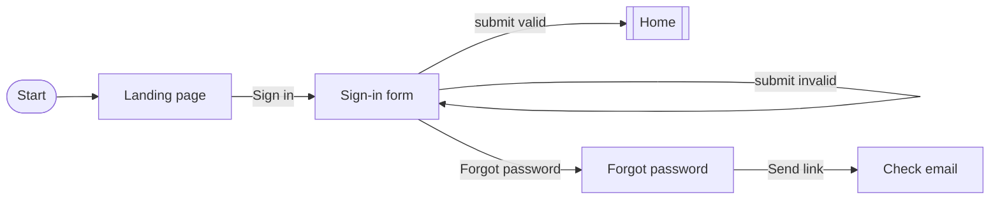
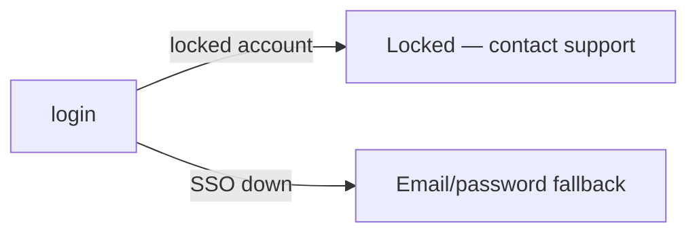

# User flows: {feature}

**Date:** {date}
**Persona:** {persona}

## Sign-in (happy path)

## Sign-in (error branches)

## Cross-flow notes

- Back button behaviour per screen is default unless noted.
- Persistent banners (e.g. "maintenance planned") are shown at
  the top and do not block the flow.
