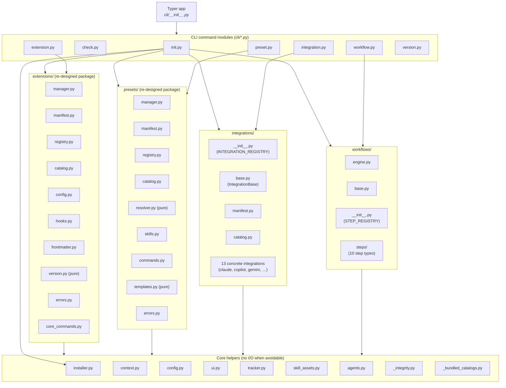
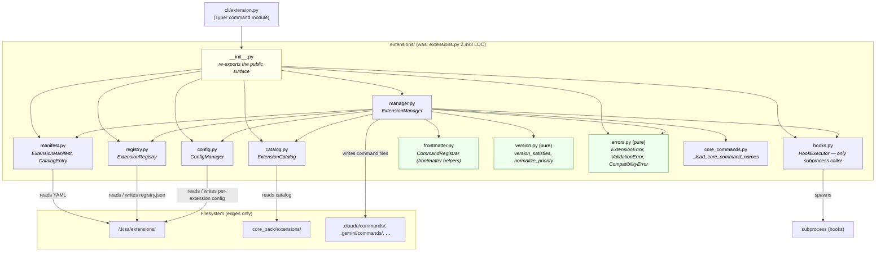
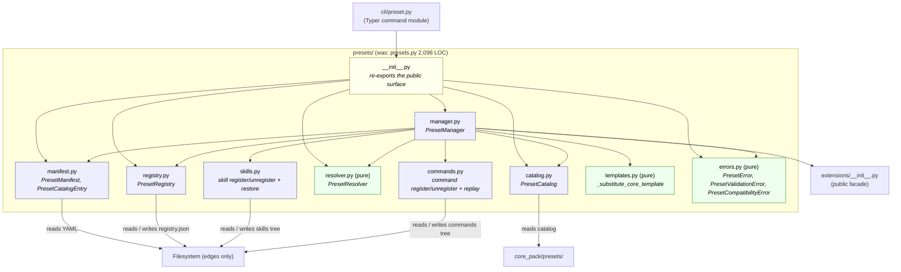

# C4 — Level 3: Components (inside the `kiss` CLI process)

**Date:** 2026-04-26
**Subject system:** KISS CLI (kiss-u) — container C1

> Drafted by `architect` (auto mode). Status: **Proposed**. Decider:
> **TBD — confirm**. The two re-designed packages
> (`extensions/` and `presets/`) replace today's monolithic
> `extensions.py` (2,493 LOC) and `presets.py` (2,098 LOC). The
> public surface (class names exported from each package) is
> preserved; this is a *decomposition*, not a rename.

## What this shows

The major modules / classes that live inside the `kiss` CLI
process (container C1), and how they collaborate. The diagrams
below focus on the parts that change in this re-design — the
extensions and presets packages.

## A. Process-level overview (current, kept)

## B. Re-designed `extensions/` package

### Diagram

### Components

| Component | Class(es) / functions exposed (preserve names) | Pure / I/O | Role |
|---|---|---|---|
| `extensions/__init__.py` | re-exports `ExtensionManifest`, `ExtensionRegistry`, `ExtensionManager`, `ExtensionCatalog`, `ConfigManager`, `HookExecutor`, `CommandRegistrar`, `ExtensionError`, `ValidationError`, `CompatibilityError`, `CatalogEntry`, `version_satisfies`, `normalize_priority` | facade | Backward-compat shim — callers in `cli/extension.py`, `presets/`, `cli/init.py` keep working unchanged |
| `extensions/errors.py` | `ExtensionError`, `ValidationError`, `CompatibilityError` | **pure** | No globals, no I/O |
| `extensions/version.py` | `version_satisfies(current, required) -> bool`, `normalize_priority(value, default=10) -> int` | **pure** | Same input → same output (Principle IV) |
| `extensions/frontmatter.py` | `CommandRegistrar.parse_frontmatter`, `CommandRegistrar.render_frontmatter` (today at `extensions.py:1457,1462`) | **pure** | Renamed away from the colliding `kiss_cli.agents.CommandRegistrar` (TDEBT-020) — recommended fresh class name `FrontmatterCodec` once accepted |
| `extensions/core_commands.py` | `_load_core_command_names() -> frozenset[str]` (today at `extensions.py:99`) | I/O at edge | Reads bundled core command list once at import |
| `extensions/manifest.py` | `ExtensionManifest`, `CatalogEntry` | I/O at edge | YAML parsing in `_load_yaml`; `_validate` stays pure once helpers are extracted |
| `extensions/registry.py` | `ExtensionRegistry` | I/O at edge | Reads / writes `<project>/.kiss/extensions/registry.json`. Path injected via constructor (already done — `extensions_dir: Path`) |
| `extensions/catalog.py` | `ExtensionCatalog` | I/O at edge | Catalog search / info / add / remove |
| `extensions/config.py` | `ConfigManager` | I/O at edge | Per-extension config read / write |
| `extensions/hooks.py` | `HookExecutor` | I/O at edge | **Only** module that calls `subprocess` for hooks |
| `extensions/manager.py` | `ExtensionManager` | composes I/O | Orchestrator. Today's 14+ methods (e.g. `install_from_directory`, `install_from_zip`, `remove`, `_register_extension_skills`, `_unregister_extension_skills`, `check_compatibility`, `list_installed`, `get_extension`) get split into ≤ 40-LOC functions during the decomposition (Principle III) |

### Sizing targets (per Principle III)

- Each module ≤ 400 LOC executable.
- Each function ≤ 40 LOC executable.
- Cyclomatic complexity ≤ 10 per function.
- Nesting depth ≤ 3.
- Public surface = the names re-exported from `__init__.py`;
  everything else is private.

### Why this layout (KISS / YAGNI)

- Splits **by side-effect type** (pure helpers vs. filesystem I/O
  vs. subprocess), not by speculative future features. This is the
  minimum cut that makes Principle IV testable and Principle III
  enforceable.
- Preserves all today's class names — no rename churn, no
  rippling test changes outside `tests/test_extensions.py`.
- Adds **one** new private class name suggestion
  (`FrontmatterCodec`) only if the user agrees to resolve TDEBT-020;
  otherwise the existing class name stays inside its new home.

## C. Re-designed `presets/` package

### Diagram

### Components

| Component | Class(es) / functions exposed (preserve names) | Pure / I/O | Role |
|---|---|---|---|
| `presets/__init__.py` | re-exports `PresetManifest`, `PresetRegistry`, `PresetManager`, `PresetCatalog`, `PresetResolver`, `PresetError`, `PresetValidationError`, `PresetCompatibilityError`, `PresetCatalogEntry` | facade | Backward-compat shim |
| `presets/errors.py` | the three exception types | **pure** | |
| `presets/templates.py` | `_substitute_core_template` (today at `presets.py:33`) | **pure** | Same input → same output |
| `presets/resolver.py` | `PresetResolver` (today at `presets.py:1797+`) | **pure** | Resolution algorithm — no filesystem |
| `presets/manifest.py` | `PresetManifest`, `PresetCatalogEntry` | I/O at edge | YAML parse + validation |
| `presets/registry.py` | `PresetRegistry` | I/O at edge | `<project>/.kiss/presets/registry.json` |
| `presets/catalog.py` | `PresetCatalog` | I/O at edge | Catalog mgmt |
| `presets/skills.py` | (private) `_register_skills`, `_unregister_skills`, `_replay_skill_override`, `_build_extension_skill_restore_index` | I/O at edge | Skill lifecycle inside a preset |
| `presets/commands.py` | (private) `_register_commands`, `_unregister_commands`, `_replay_wraps_for_command`, `_skill_title_from_command` | I/O at edge | Command lifecycle inside a preset |
| `presets/manager.py` | `PresetManager` | composes I/O | Orchestrator. Today's `install_from_directory`, `install_from_zip`, `remove`, `list_installed`, `get_pack`, `check_compatibility` get split into ≤ 40-LOC functions (Principle III) |

### Sizing targets

Same as the extensions package: ≤ 400 LOC per module, ≤ 40 LOC per
function, cyclomatic ≤ 10, nesting ≤ 3.

## D. Cross-package contracts (preserve)

The following inbound edges to `extensions/` and `presets/` MUST
keep working through the public facades:

| Caller | Symbol | Source line (current) |
|---|---|---|
| `cli/extension.py` | `ExtensionManager`, `ExtensionRegistry`, `ExtensionCatalog`, `ConfigManager`, etc. | imported as `from kiss_cli.extensions import …` |
| `cli/preset.py` | `PresetManager`, `PresetRegistry`, `PresetCatalog`, `PresetResolver`, exceptions | `from kiss_cli.presets import …` |
| `cli/init.py` | both managers (preset install path) | top of file |
| `presets/manager.py` (new) | `extensions.ExtensionManager` (preset → extension dependency) | `presets.py:27-28` (today imports `packaging`, plus uses `extensions` package indirectly) |

The decomposition keeps the `from kiss_cli.extensions import X` /
`from kiss_cli.presets import X` form intact, so callers do not
move. ADR-013 / ADR-014 capture this commitment.

## E. Notes / non-goals

- **No new features.** Per Principle I, the re-design adds no new
  capability — it splits existing code along an existing seam
  (side-effect type) so the size limits become enforceable.
- **No rename of public classes.** Renames are a separate
  decision (TDEBT-020 covers the only collision today).
- **No change to the integration / workflow packages.** Those
  modules are already small enough to satisfy Principle III at
  module scale (`integrations/base.py` at 1,374 LOC is the next
  candidate after this re-design lands but is out of scope here —
  noted as TDEBT-022).
- **Code-level structure (function bodies, signatures of new
  helpers) belongs in `docs/design/<feature>/design.md`,** not in
  this Level-3 view. The developer agent picks that up after the
  ADRs are accepted.
