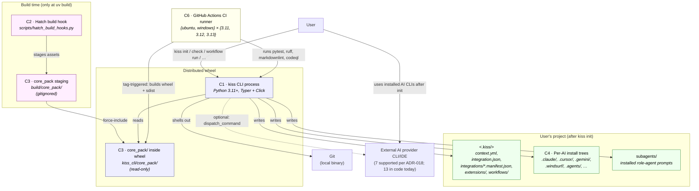

# C4 — Level 2: Containers

**Date:** 2026-04-26
**Subject system:** KISS CLI (kiss-u)

> Drafted by `architect` (auto mode). Status: **Proposed**. Decider:
> **TBD — confirm**. Sourced from `docs/architecture/extracted.md`
> §2 and the codebase scan.

## What this shows

The independently runnable / deployable units inside KISS, plus
build-time and CI containers, and how they talk to each other.

A "container" here is anything with its own lifecycle: a process,
a build hook invocation, a static asset bundle, an installed file
tree, or a CI runner.

## Diagram

## Containers

| ID | Name | Technology | Responsibility | Owner |
|---|---|---|---|---|
| C1 | `kiss` CLI process | Python 3.11+, Typer 0.24+, Click 8.3+, Rich, PyYAML, json5 | Read project state, write project tree, manage integrations / extensions / presets / workflows | KISS dev team |
| C2 | Hatch build hook | `hatchling` + custom `CustomBuildHook` (`scripts/hatch_build_hooks.py:104`) | At `uv build` time: stage assets to `build/core_pack/` and generate `sha256sums.txt` | KISS dev team |
| C3 | `core_pack` asset bundle | Static directory tree (Markdown, YAML, JSON, Bash, PowerShell) | Ship every preset, extension, workflow, agent skill, integrations catalog inside the wheel | KISS dev team |
| C4 | Per-AI installed file trees | Static text (one folder per integration) | Be consumed by external AI tools (Claude, Cursor, Gemini, …) per their respective conventions | User project |
| C5 | External AI provider CLI/IDE | each provider's own runtime | Execute the prompts/skills KISS installed | external |
| C6 | GitHub Actions CI runner | `ubuntu-latest`, `windows-latest`; uv, pytest, ruff, markdownlint-cli2, CodeQL | Build, test, lint, release | GitHub Actions |

## Communication matrix

| From | To | Protocol / mechanism | Notes |
|---|---|---|---|
| User | C1 | command-line invocation | `kiss <subcommand>` |
| C1 | C3 | filesystem read | Resolved by `_locate_core_pack()` (`installer.py:301-315`); falls back to source checkout when `kiss_cli/core_pack/` is absent. |
| C1 | C4 | filesystem write (hashed) | Each write is recorded in `<.kiss>/integrations/<key>.manifest.json` (`integrations/manifest.py:50-265`). |
| C1 | Git | subprocess | `installer.py:126-149`. |
| C1 | C5 | subprocess (optional) | `IntegrationBase.dispatch_command` (`integrations/base.py:147-225`). |
| C2 | C3 | filesystem write at build time | Wipes + rebuilds `build/core_pack/` (`hatch_build_hooks.py:113-127`). |
| C6 | C1 | invokes via `uv run pytest` | Test matrix (`.github/workflows/test.yml:30-55`). |
| C6 | GitHub Releases | upload artefacts | `.github/workflows/release.yml:128-138`. |

## Architectural invariants (mandated by the re-design)

These are constraints the standards already imply but that must
be made explicit at the container level:

1. **Offline runtime invariant.** Once C3 is on disk, C1 must not
   open a network socket. Defended by `tests/test_offline.py` —
   recommended ADR-017 extends that test to cover *every* `kiss`
   subcommand, not just `init`.
2. **Bash / PowerShell parity invariant.** Every skill in C3
   ships both `scripts/bash/` and `scripts/powershell/`. Recommended
   ADR-015 promotes this from "team rule" to "architectural
   constraint" with a parity test (TDEBT-021).
3. **Asset integrity invariant.** C3 is read-only at runtime; C2
   produces `core_pack/sha256sums.txt` and `_integrity.py:24-79`
   *can* verify it. Recommended ADR-007 (promoted from CADR-007)
   commits to this at architecture level; the production call
   site is missing today (TDEBT-002).
4. **Hashed-write invariant.** Every file C1 writes into the
   user's project is hashed in a per-integration manifest, so
   uninstall and upgrade can preserve user-modified files
   (ADR-004, promoted from CADR-004).
5. **Static integration registry invariant.** C1 has no plugin
   discovery; `_register_builtins()` (`integrations/__init__.py:40-81`)
   is the only enrolment point (ADR-009).

## Re-design vs. current state

The container shape is **unchanged** by the re-design — same six
containers, same communication topology. Every re-design move
lives one level deeper, inside C1 itself, and is captured in
`c4-component.md`.
