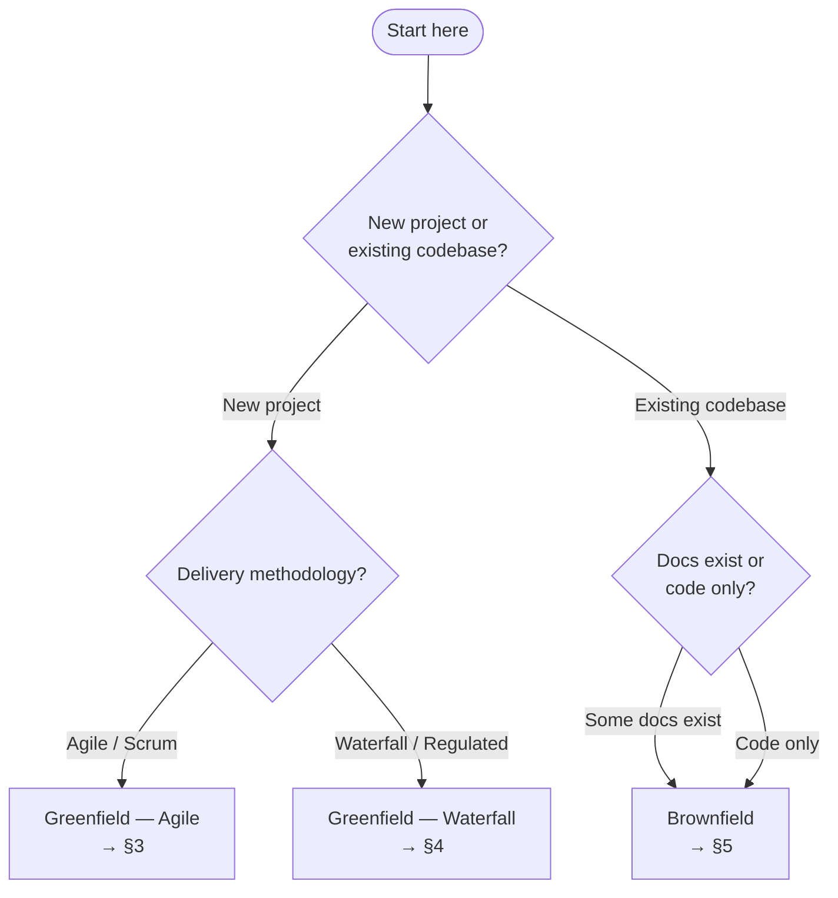
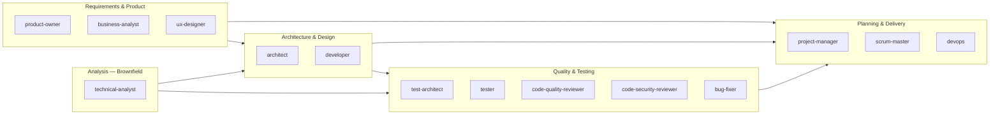
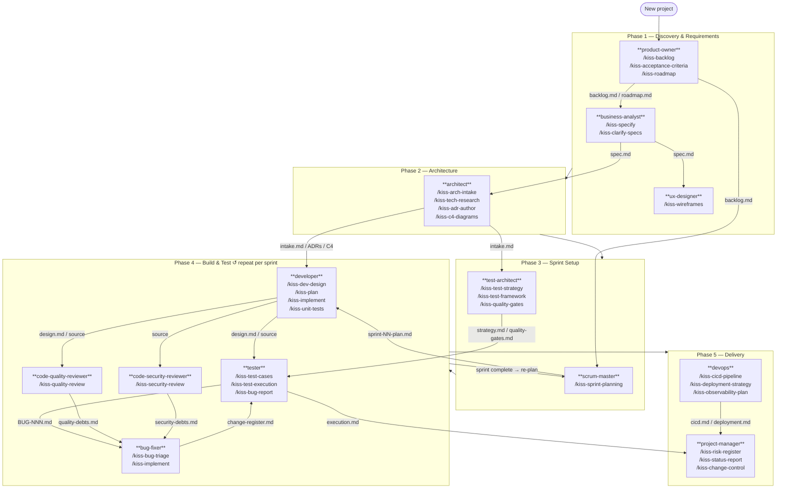
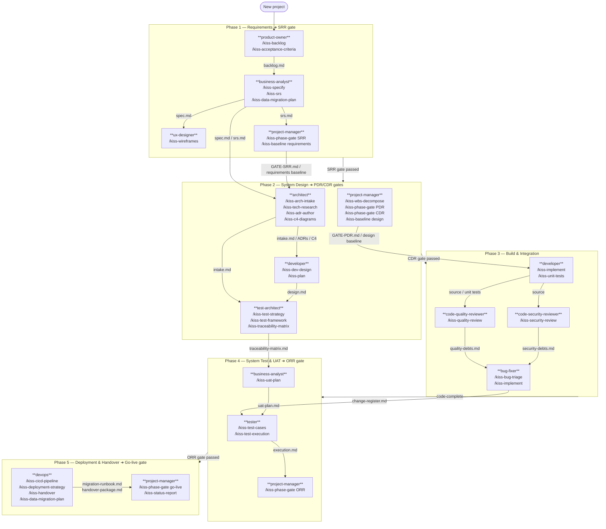
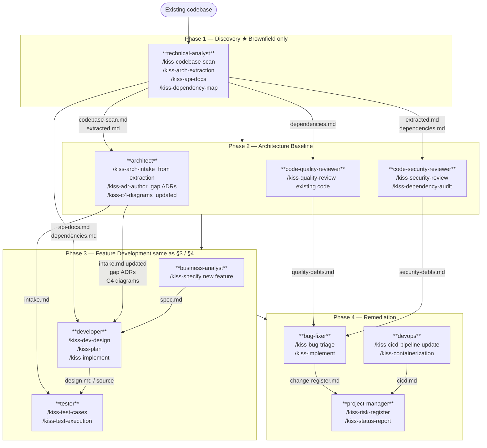
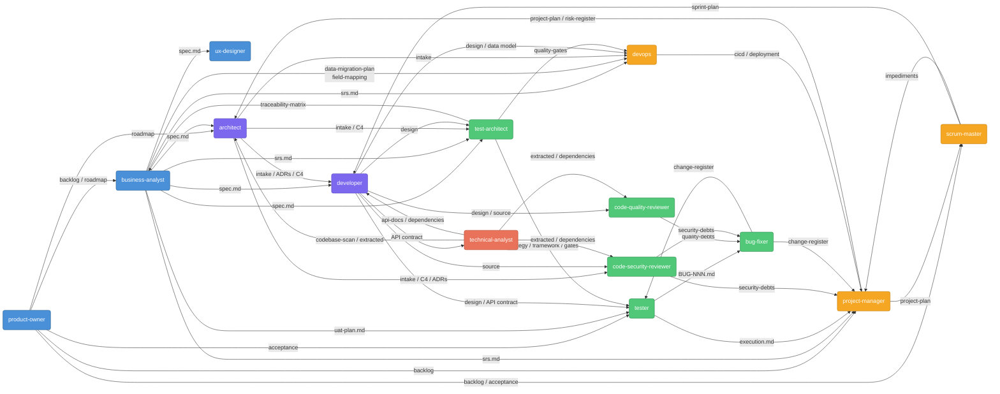

# KISS Subagent User Guide

> This guide explains how all 14 KISS role agents interconnect, what commands
> they expose, what artefacts they consume and produce, and which order to run
> them for **greenfield** (new project) and **brownfield** (existing codebase)
> projects.

---

## Table of Contents

1. [Choosing Your Starting Point](#1-choosing-your-starting-point)
2. [Agent Ecosystem Overview](#2-agent-ecosystem-overview)
3. [Greenfield Workflow — Agile / Scrum](#3-greenfield-workflow--agile--scrum)
4. [Greenfield Workflow — Waterfall / Regulated](#4-greenfield-workflow--waterfall--regulated)
5. [Brownfield Workflow](#5-brownfield-workflow)
6. [Cross-Agent Data Flow](#6-cross-agent-data-flow)
7. [Agent Reference](#7-agent-reference)

---

## 1. Choosing Your Starting Point

---

## 2. Agent Ecosystem Overview

The 14 role agents cluster into five functional zones.

### Agent summary

| Agent | Zone | Primary commands |
|-------|------|-----------------|
| `business-analyst` | Requirements | `/kiss-specify` `/kiss-clarify-specs` `/kiss-srs` `/kiss-uat-plan` `/kiss-data-migration-plan` |
| `product-owner` | Requirements | `/kiss-backlog` `/kiss-acceptance-criteria` `/kiss-roadmap` `/kiss-tasks-to-issues` |
| `ux-designer` | Requirements | `/kiss-wireframes` |
| `architect` | Architecture | `/kiss-arch-intake` `/kiss-tech-research` `/kiss-adr-author` `/kiss-c4-diagrams` |
| `developer` | Design & Build | `/kiss-dev-design` `/kiss-plan` `/kiss-implement` `/kiss-unit-tests` |
| `project-manager` | Planning | `/kiss-project-planning` `/kiss-wbs-decompose` `/kiss-phase-gate` `/kiss-baseline` `/kiss-risk-register` `/kiss-status-report` `/kiss-change-control` |
| `scrum-master` | Planning | `/kiss-sprint-planning` `/kiss-standup` `/kiss-retrospective` |
| `devops` | Delivery | `/kiss-cicd-pipeline` `/kiss-infrastructure-plan` `/kiss-containerization` `/kiss-observability-plan` `/kiss-deployment-strategy` `/kiss-handover` `/kiss-data-migration-plan` |
| `test-architect` | Quality | `/kiss-test-strategy` `/kiss-test-framework` `/kiss-quality-gates` `/kiss-traceability-matrix` |
| `tester` | Quality | `/kiss-test-cases` `/kiss-test-execution` `/kiss-bug-report` `/kiss-regression-tests` |
| `code-quality-reviewer` | Quality | `/kiss-quality-review` |
| `code-security-reviewer` | Quality | `/kiss-security-review` `/kiss-dependency-audit` |
| `bug-fixer` | Quality | `/kiss-bug-triage` `/kiss-implement` `/kiss-regression-tests` `/kiss-change-log` |
| `technical-analyst` | Analysis | `/kiss-codebase-scan` `/kiss-arch-extraction` `/kiss-api-docs` `/kiss-dependency-map` |

---

## 3. Greenfield Workflow — Agile / Scrum

### Agile artefact map

| Phase | Artefact | Produced by |
|-------|----------|-------------|
| Discovery | `docs/product/backlog.md` | product-owner |
| Discovery | `docs/product/roadmap.md` | product-owner |
| Discovery | `docs/specs/<feature>/spec.md` | business-analyst |
| Discovery | `docs/ux/<feature>/wireframes.md` | ux-designer |
| Architecture | `docs/architecture/intake.md` | architect |
| Architecture | `docs/decisions/ADR-NNN-*.md` | architect |
| Architecture | `docs/architecture/c4-context.md` | architect |
| Sprint Setup | `docs/agile/sprint-NN-plan.md` | scrum-master |
| Sprint Setup | `docs/testing/<feature>/strategy.md` | test-architect |
| Sprint Setup | `docs/testing/<feature>/quality-gates.md` | test-architect |
| Build | `docs/design/<feature>/design.md` | developer |
| Build | `docs/design/<feature>/api-contract.md` | developer |
| Build | `docs/testing/<feature>/test-cases.md` | tester |
| Build | `docs/testing/<feature>/execution.md` | tester |
| Build | `docs/bugs/BUG-NNN-*.md` | tester |
| Delivery | `docs/operations/cicd.md` | devops |
| Delivery | `docs/operations/deployment.md` | devops |

---

## 4. Greenfield Workflow — Waterfall / Regulated

The Waterfall variant adds formal **phase gates**, a consolidated **SRS**,
a **requirements traceability matrix (RTM)**, a **UAT plan** (owned by
`business-analyst`), and a go-live **handover package**. The `project-manager`
orchestrates all gates and baselines.

### Additional Waterfall artefacts

| Phase | Artefact | Produced by |
|-------|----------|-------------|
| Requirements | `docs/analysis/srs.md` | business-analyst |
| Requirements | `docs/project/gates/GATE-SRR-*.md` | project-manager |
| Requirements | `docs/baselines/requirements/manifest.md` | project-manager |
| Design | `docs/project/wbs-index.md` | project-manager |
| Design | `docs/project/gates/GATE-PDR-*.md` | project-manager |
| Design | `docs/project/gates/GATE-CDR-*.md` | project-manager |
| Design | `docs/baselines/design/manifest.md` | project-manager |
| Design | `docs/analysis/traceability-matrix.md` | test-architect |
| Testing | `docs/analysis/uat-plan/<feature>/uat-plan.md` | business-analyst |
| Testing | `docs/analysis/uat-plan/<feature>/uat-sign-off.md` | business-analyst |
| Testing | `docs/project/gates/GATE-ORR-*.md` | project-manager |
| Delivery | `docs/operations/handover/handover-package.md` | devops |
| Delivery | `docs/operations/migration-runbook.md` | devops |
| Delivery | `docs/analysis/data-migration-plan.md` | business-analyst |
| Delivery | `docs/analysis/field-mapping.md` | business-analyst |

### Phase gate summary

| Gate | Trigger | Owner | Key inputs checked |
|------|---------|-------|--------------------|
| SRR — System Requirements Review | All feature specs approved | project-manager | `srs.md`, `spec.md` files |
| PDR — Preliminary Design Review | Architecture intake + ADRs + C4 approved | project-manager | `intake.md`, `ADR-*.md`, `c4-*.md` |
| CDR — Critical Design Review | Detailed design + RTM complete | project-manager | `design.md`, `traceability-matrix.md` |
| ORR — Operational Readiness Review | System test passed + UAT signed off | project-manager | `execution.md`, `uat-sign-off.md` |
| Go-live | Deployment plan + handover package ready | project-manager | `deployment.md`, `handover-package.md` |

---

## 5. Brownfield Workflow

Brownfield projects start with `technical-analyst` scanning the existing
codebase to produce a discovered baseline. The outputs seed the architect
and developer agents, bypassing the initial specification phase (though a
new-feature spec is still recommended for any change work).

### Brownfield discovery artefacts

| Artefact | Path | Notes |
|----------|------|-------|
| Codebase scan | `docs/analysis/codebase-scan.md` | Language, LOC, entry points, tooling |
| Extracted architecture | `docs/architecture/extracted.md` | Containers + components reverse-engineered from source |
| Extracted API docs | `docs/analysis/api-docs.md` | Endpoint/schema inventory from existing routes |
| Dependency map | `docs/analysis/dependencies.md` + `module-graph.mmd` | Internal module graph + external package list |
| Gap ADRs | `docs/decisions/ADR-NNN-*.md` | Architect records undocumented decisions found in extraction |

### Brownfield vs. greenfield comparison

| Aspect | Greenfield | Brownfield |
|--------|-----------|------------|
| First agent | `product-owner` or `business-analyst` | `technical-analyst` |
| Architecture source | Freshly authored by `architect` | Extracted by `technical-analyst`, refined by `architect` |
| Spec requirement | Always needed | Needed for new features; existing behaviour inferred from scan |
| Dependency audit | Optional | Strongly recommended (run `code-security-reviewer` early) |
| Quality debts | Accumulate from new code | Existing debts surfaced immediately by `code-quality-reviewer` |

---

## 6. Cross-Agent Data Flow

The diagram below shows every significant artefact that crosses an agent
boundary. Agents are coloured by zone.

---

## 7. Agent Reference

### business-analyst

Drafts and refines feature specifications, SRS, UAT plans, and data
migration strategy.

**Commands**: `/kiss-specify` · `/kiss-clarify-specs` · `/kiss-srs` ·
`/kiss-uat-plan` · `/kiss-data-migration-plan`

**Reads from**: product-owner → `backlog.md` · architect → `architecture/**`
· test-architect → `traceability-matrix.md`

| Artefact | Path | When |
|----------|------|------|
| Feature spec | `docs/specs/<feature>/spec.md` | Always |
| Requirement debts | `docs/specs/requirement-debts.md` | Always |
| SRS | `docs/analysis/srs.md` | Waterfall / regulated |
| UAT plan | `docs/analysis/uat-plan/<feature>/uat-plan.md` | Waterfall / regulated |
| UAT sign-off | `docs/analysis/uat-plan/<feature>/uat-sign-off.md` | Waterfall / regulated |
| Data migration plan | `docs/analysis/data-migration-plan.md` | If legacy data migration needed |
| Field mapping | `docs/analysis/field-mapping.md` | If legacy data migration needed |

---

### product-owner

Maintains the ordered product backlog, acceptance criteria, and roadmap.
Converts approved items to GitHub issues.

**Commands**: `/kiss-backlog` · `/kiss-acceptance-criteria` · `/kiss-roadmap`
· `/kiss-tasks-to-issues`

**Reads from**: business-analyst → specs · architect → feasibility ·
project-manager → plan constraints

| Artefact | Path |
|----------|------|
| Product backlog | `docs/product/backlog.md` |
| Acceptance criteria | `docs/product/acceptance.md` |
| Roadmap | `docs/product/roadmap.md` |
| Product debts | `docs/product/product-debts.md` |

---

### ux-designer

Produces text-based wireframes and Mermaid user-flow diagrams.

**Commands**: `/kiss-wireframes`

**Reads from**: business-analyst → spec · product-owner → acceptance criteria

| Artefact | Path |
|----------|------|
| Wireframes | `docs/ux/<feature>/wireframes.md` |
| User flows | `docs/ux/<feature>/user-flows.md` |
| UX debts | `docs/ux/ux-debts.md` |

---

### architect

Captures quality-attribute intake, researches technology options, records
decisions as ADRs, and drafts C4 diagrams.

**Commands**: `/kiss-arch-intake` · `/kiss-tech-research` · `/kiss-adr-author`
· `/kiss-c4-diagrams` · `/kiss-clarify-specs` · `/kiss-plan` ·
`/kiss-standardize`

**Reads from**: business-analyst → spec · product-owner → backlog ·
project-manager → project plan

| Artefact | Path |
|----------|------|
| Architecture intake | `docs/architecture/intake.md` |
| C4 context diagram | `docs/architecture/c4-context.md` |
| C4 container diagram | `docs/architecture/c4-container.md` |
| C4 component diagram | `docs/architecture/c4-component.md` |
| ADRs | `docs/decisions/ADR-NNN-<slug>.md` |
| Technology research | `docs/research/<topic>.md` |
| Tech debts | `docs/architecture/tech-debts.md` |

---

### developer

Turns the architect's blueprint into a concrete module design, API contract,
and data model; scaffolds unit tests; drives implementation via the SDD
plan → taskify → implement chain.

**Commands**: `/kiss-dev-design` · `/kiss-plan` · `/kiss-implement` ·
`/kiss-unit-tests` · `/kiss-standardize`

**Reads from**: business-analyst → spec · architect → intake + ADRs ·
product-owner → acceptance criteria · project-manager → plan

| Artefact | Path |
|----------|------|
| Implementation plan | `docs/plans/<feature>/plan.md` |
| Detailed design | `docs/design/<feature>/design.md` |
| API contract | `docs/design/<feature>/api-contract.md` |
| Data model | `docs/design/<feature>/data-model.md` |
| Unit test index | `docs/testing/<feature>/unit-tests-index.md` |
| Source edits | project source tree |

> **Note:** The developer authors the authoritative API contract for new
> endpoints. The `technical-analyst` validates it matches the implementation
> on brownfield projects.

---

### project-manager

Drafts the project plan, WBS, risk register, phase gates, baselines, status
reports, and change log. Primarily used on Waterfall / regulated projects;
Agile projects use `scrum-master` for sprint cadence.

**Commands**: `/kiss-project-planning` · `/kiss-wbs-decompose` ·
`/kiss-phase-gate` · `/kiss-baseline` · `/kiss-risk-register` ·
`/kiss-status-report` · `/kiss-change-control` · `/kiss-taskify` ·
`/kiss-feature-checklist` · `/kiss-standardize`

**Reads from**: business-analyst → specs · architect → architecture ·
product-owner → product · tester/bug-fixer → bugs ·
code-security-reviewer → security debts

| Artefact | Path |
|----------|------|
| Project plan | `docs/project/project-plan.md` |
| Communication plan | `docs/project/communication-plan.md` |
| WBS index | `docs/project/wbs-index.md` |
| Risk register | `docs/project/risk-register.md` |
| Status report | `docs/project/status-YYYY-MM-DD.md` |
| Phase gate | `docs/project/gates/GATE-<type>-<date>.md` |
| Baseline manifest | `docs/baselines/<label>/manifest.md` |
| Change log | `docs/project/change-log.md` |

---

### scrum-master

Drafts sprint plans, logs standup notes, and synthesises retrospective notes
into action items.

**Commands**: `/kiss-sprint-planning` · `/kiss-standup` · `/kiss-retrospective`
· `/kiss-taskify` · `/kiss-feature-checklist`

**Reads from**: product-owner → backlog + acceptance ·
project-manager → project plan

| Artefact | Path |
|----------|------|
| Sprint plan | `docs/agile/sprint-NN-plan.md` |
| Standup notes | `docs/agile/standups/YYYY-MM-DD.md` |
| Impediments | `docs/agile/impediments.md` |
| Retrospective | `docs/agile/retro-sprint-NN.md` |
| Action items | `docs/agile/action-items.md` |

---

### test-architect

Drafts the feature-scoped test strategy, framework recommendation, quality
gates, and requirements traceability matrix (RTM).

**Commands**: `/kiss-test-strategy` · `/kiss-test-framework` ·
`/kiss-quality-gates` · `/kiss-traceability-matrix` · `/kiss-plan` ·
`/kiss-standardize`

**Reads from**: business-analyst → spec + SRS · architect → intake ·
project-manager → risk register

| Artefact | Path |
|----------|------|
| Test strategy | `docs/testing/<feature>/strategy.md` |
| Framework recommendation | `docs/testing/<feature>/framework.md` |
| Quality gates | `docs/testing/<feature>/quality-gates.md` |
| RTM | `docs/analysis/traceability-matrix.md` |
| Test debts | `docs/testing/<feature>/test-debts.md` |

---

### tester

Writes executable test cases, maintains the test-execution ledger, authors
structured bug reports, and owns the regression test index.

**Commands**: `/kiss-test-cases` · `/kiss-test-execution` · `/kiss-bug-report`
· `/kiss-regression-tests` · `/kiss-taskify` · `/kiss-verify-tasks`

**Reads from**: test-architect → strategy + framework ·
business-analyst → UAT plan · developer → design ·
product-owner → acceptance criteria

| Artefact | Path |
|----------|------|
| Test cases | `docs/testing/<feature>/test-cases.md` |
| Execution ledger | `docs/testing/<feature>/execution.md` |
| Bug report | `docs/bugs/BUG-NNN-<slug>.md` |
| Regression index | `docs/testing/regression-index.md` |
| Test debts | `docs/testing/<feature>/test-debts.md` |

> **Note:** The `bug-fixer` writes the regression test code; the `tester`
> owns the index and validates each entry runs in CI.

---

### code-quality-reviewer

Reviews source code for maintainability, complexity, SOLID/DRY/KISS, and
project-standards compliance.

**Commands**: `/kiss-quality-review` · `/kiss-standardize`

**Reads from**: developer → design + source · architect → intake

| Artefact | Path |
|----------|------|
| Quality review | `docs/reviews/<feature>/quality.md` |
| Quality debts | `docs/reviews/quality-debts.md` *(append)* |

---

### code-security-reviewer

Reviews code and config against OWASP Top 10:2025, STRIDE, and common CWE
patterns. Also audits third-party dependencies.

**Commands**: `/kiss-security-review` · `/kiss-dependency-audit`

**Reads from**: architect → C4 + intake + ADRs · developer → source ·
devops → infra config

| Artefact | Path |
|----------|------|
| Security review | `docs/reviews/<feature>/security.md` |
| Dependency audit | `docs/reviews/<feature>/dependencies.md` |
| Security debts | `docs/reviews/security-debts.md` *(append)* |

---

### bug-fixer

Triages the bug backlog, applies minimal targeted fixes, writes regression
test code, and records all changes in the change register.

**Commands**: `/kiss-bug-triage` · `/kiss-implement` · `/kiss-regression-tests`
· `/kiss-change-log` · `/kiss-verify-tasks`

**Reads from**: tester → bug reports · code-quality-reviewer → quality debts
· code-security-reviewer → security debts

| Artefact | Path |
|----------|------|
| Triage | `docs/bugs/triage.md` |
| Change register | `docs/bugs/change-register.md` |
| Regression tests | project test tree *(code only)* |
| Fix debts | `docs/bugs/fix-debts.md` *(append)* |

---

### devops

Drafts CI/CD, IaC, container strategy, observability plan, deployment
runbook, and ops handover. For projects with legacy data migration, translates
the `business-analyst`-authored migration strategy into a technical cutover
runbook.

**Commands**: `/kiss-cicd-pipeline` · `/kiss-infrastructure-plan` ·
`/kiss-containerization` · `/kiss-observability-plan` ·
`/kiss-deployment-strategy` · `/kiss-handover` · `/kiss-data-migration-plan`

**Reads from**: architect → C4 + intake · test-architect → quality gates ·
business-analyst → SRS + `data-migration-plan.md` + `field-mapping.md`

| Artefact | Path | When |
|----------|------|------|
| CI/CD design | `docs/operations/cicd.md` | Always |
| Infrastructure plan | `docs/operations/infra.md` | Always |
| Container strategy | `docs/operations/containers.md` | If containerised |
| Observability plan | `docs/operations/monitoring.md` | Always |
| Deployment runbook | `docs/operations/deployment.md` | Always |
| Handover package | `docs/operations/handover/handover-package.md` | Waterfall / production |
| Migration runbook | `docs/operations/migration-runbook.md` | If legacy data migration |
| Ops debts | `docs/operations/ops-debts.md` | Always |

---

### technical-analyst

Scans an existing codebase and produces a technology overview, extracted
architecture, API docs, and dependency map. **Brownfield only** — run
before `architect` on existing projects.

**Commands**: `/kiss-codebase-scan` · `/kiss-arch-extraction` · `/kiss-api-docs`
· `/kiss-dependency-map`

**Reads from**: source tree (authoritative) · architect → existing intake +
ADRs (cross-check)

| Artefact | Path |
|----------|------|
| Codebase scan | `docs/analysis/codebase-scan.md` |
| Extracted architecture | `docs/architecture/extracted.md` |
| Extracted API docs | `docs/analysis/api-docs.md` |
| Dependency map | `docs/analysis/dependencies.md` + `module-graph.mmd` |
| Analysis debts | `docs/analysis/analysis-debts.md` |

> **Note:** The `technical-analyst` documents extracted API docs for existing
> endpoints. For new endpoints, the `developer` authors the authoritative
> API contract and the `technical-analyst` validates it matches the
> implementation.
